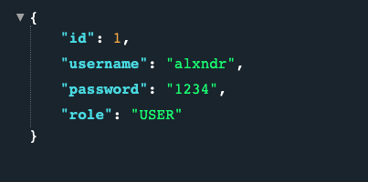

# PasswordEncoder 설정하기

기존의 `{noop}` 문자열을 더해줘서 Password encoding 하던 것을 `Spring Security`가 지원해주는 
`PasswordEncoder`를 사용해보겠습니다.

### Bean 등록
- Application
```java
@SpringBootApplication
public class Application {

    @Bean
    public PasswordEncoder passwordEncoder() {
        return NoOpPasswordEncoder.getInstance();
    } // 1

    public static void main(String[] args) {
        SpringApplication.run(Application.class, args);
    }

}
```
1. PasswordEncoder를 Bean를 등록해줍니다.
2. 우리가 선택한 NoOpPasswordEncoder는 Spring Framework 5이전에 사용되던 방식입니다.
3. 현재는 `Deprecated`된 상태입니다.

### 등록한 Bean 주입받아서 유저 등록 시 encoding하기
- AccountService
```java
@Service
@RequiredArgsConstructor
public class AccountService implements UserDetailsService {
    ... 생략
    private final PasswordEncoder passwordEncoder;  // 1

    public Account createAccount(Account account) {
        account.setPassword(passwordEncoder.encode(account.getPassword())); // 2
        return accountRepository.save(account);
    }
}
```
1. `AccountService`에서 Bean으로 등록한 `PasswordEncoder`를 생성자주입방식으로 주입받습니다.
2. `{noop}`문자열을 더해주던 부분에 주입받은 `PasswordEncoder`를 사용하여 `encode`해줍니다.

### 확인
서버를 구동하여 지난 번글과 같이 
`http://localhost:8080/account/USER/alxndr/1234` 유저를 등록해보면

그림과 같이 `{noop}`은 붙어있지않은 패스워드가 저장되게 됩니다.   

그리고 `/dashboard`로 접속하여 로그인해보면 정상적으로 로그인되는 것을 확인 할 수 있습니다.   

### 왜 Spring 5에서는 특이한 포멧이 생겼는가?
[패스워드인코더의역사..참고](https://docs.spring.io/spring-security/site/docs/current/reference/html5/#authentication-password-storage-history)
1. 기본 전략이 Bcrypt로 변경되었습니다.
    - 만약 이전 Spring 4에서 패스워드를 평문으로 저장하고 있었다면, 버전을 5로 올리게되면 인증이 꺠지게 됩니다.
    - 여러 프로젝트들은 여러가지 암호화 알고리즘을 사용하고 있습니다.

-> 이러한 이유로 `{ID}~~`라는 포멧이 생겨나게 됐습니다.

## PasswordEncoder 변경
등록한 Bean을 수정해주겠습니다.
- Application
```java
@SpringBootApplication
public class Application {

    @Bean
    public PasswordEncoder passwordEncoder() {
        return PasswordEncoderFactories.createDelegatingPasswordEncoder();  // 1
    }
    ... 생략
}
```
1. `PasswordEncoderFactories`에서 `createDelegatingPasswordEncoder()`를 반환합니다.

- `createDelegatingPasswordEncoder`

같이 다양한 Encoder를 가지고 있습니다.

## 확인
다시한번 서버를 재구동 후 유저를 만들어보면

그림과 같이 `bcrypt`로 암호화되어 저장된것을 확인할 수 있습니다.


## 강의 번외
패스워드를 저장하는 것까지는 봤습니다.


사진과 같이 저장한 비밀번호와 `1234`가 같은 패스워드인지 확인하는 과정을 보겠습니다.

1. 우선 `PasswordEncoderFactories`는 `Map`으로 된 Encoder 묶음?을 리턴해줍니다.

2. `PasswordEncoder`의 실제 구현체는 `DelegatingPasswordEncoder`를 사용하게 되고 그 안에 `matches()`를 확인해보겠습니다.

    1.`rawPassword`와 DB에 저장된 암호화된 패스워드를 인자로 받습니다.
    2. `extractId(prefixEncodedPassword)`를 통해 암호화된 패스워드가 어떤 알고리즘인지 확인합니다.
    3. `this.idToPasswordEncoder` Map에서 id로 해당 PasswordEncoder를 찾아온다.
    
