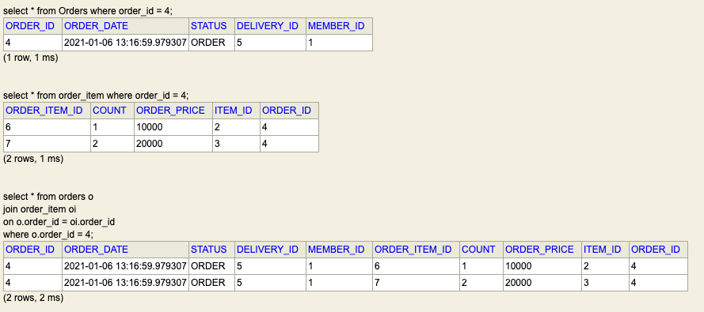

# 주문 조회로 xToOne 관계살펴보기_2.md

## Collection(일대다) 조회 최적화 v2

1편에서는 Entity를 그대로 노출했지만 좋지않은 방법이다.
그러므로 DTO로 변환해보도록 한다.


- OrderApiController.java  
```java
@GetMapping("/api/v2/orders")
public List<OrderDto> ordersV2() {
    List<Order> orders = orderRepository.findAllByCriteria(new OrderSearch());
    List<OrderDto> collect = orders.stream()
            .map(o -> new OrderDto(o))
            .collect(Collectors.toList());

    return collect;
}
```
- OrderApiController.java [inner class]

```java
@Data
static class OrderDto {
    private Long orderId;
    private String name;
    private LocalDateTime orderDate;
    private OrderStatus orderStatus;
    private Address address;
    private List<OrderItemDto> orderItems;

    public OrderDto(Order o) {
        this.orderId = o.getId();
        this.name = o.getMember().getName();
        this.orderDate = o.getOrderDate();
        this.orderStatus = o.getStatus();
        this.address = o.getDelivery().getAddress();
        orderItems = o.getOrderItems().stream()
                .map(oi -> new OrderItemDto(oi))
                .collect(Collectors.toList());
    }
}

@Getter
static class OrderItemDto {
    private String itemName;
    private int orderPrice;
    private int count;

    public OrderItemDto(OrderItem oi) {
        this.itemName = oi.getItem().getName();
        this.orderPrice = oi.getOrderPrice();
        this.count = oi.getCount();
    }
}
```

- result
```json
{
    "orderId": 4,
    "name": "USER A",
    "orderDate": "2021-01-06T13:16:59.979307",
    "orderStatus": "ORDER",
    "address": {
        "city": "SEOUL",
        "street": "123",
        "zipcode": "321312"
    },
    "orderItems": [
        {
            "itemName": "JPA 1 BOOK",
            "orderPrice": 10000,
            "count": 1
        },
        {
            "itemName": "JPA 2 BOOK",
            "orderPrice": 20000,
            "count": 2
        }
    ]
}
```

> OrderDto에서 OrderItemDto를 만들어서 Entity를 외부로 노출하지 않도록 주의한다.

위와 같은 방식으로하면 SQL이 엄청 많이 나가게된다.

Order -> Member, Delivery, OrderItems -> Item, Item
Query가 실행된다.

## 다음에 Fetch Join으로 최적화해보겠습니다.


---
# v3로 최적화하기 (feat.distinct)

- OrderRepository.java
```java
public List<Order> findAllWithItem() {
    return em.createQuery(
            "select o from Order o " +
            "join fetch o.member m " +
            "join fetch o.delivery d " +
            "join fetch o.orderItems oi " +
            "join fetch oi.item", Order.class)
        .getResultList();
}
```


위 처럼 하게되면 데이터가 조인이 되면서 주문데이터가 2개로 늘어나게 된다. OneToMany를 Join할 때는 조심해야한다.


- OrderRepository.java
```java
public List<Order> findAllWithItem() {
    return em.createQuery(
        "select distinct o from Order o " +
                "join fetch o.member m " +
                "join fetch o.delivery d " +
                "join fetch o.orderItems oi " +
                "join fetch oi.item", Order.class)
        .getResultList();
}
```

`distinct` 명령어로 중복되는 컬럼을 제거해줘야한다.

> `distinct`는 실제 sql에 distinct를 해주고 같은 ID를 가진 Entity가 있다면 제거해준다.